#### Alejandro Priego Izquierdo
# Implementa los ejemplos propuestos en el apartado 1.4 del tema y pruébalo con las distintos navegadores web (Chrome, Edge, Firefox, Opera...)

## Utiliza al menos tres entornos de desarrollo: Intellij, Sublime, Atom, Visual Studio Code...

Realiza un tutorial por cada uno de los editores donde aparezca:

- Instalaciones necesarias para reconocimiento de código HTML y JavaScript
- Atajos en ambos lenguajes. (mínimo de 5)

En los tres navegadores indica:

1. Teclas de acceso rápido que muestren las herramientas de desarrollo.
2. Acceso a la consola
3. Acceso a los ficheros (mensaje.js en nuestro caso)
4. Reglas CSS
5. Depurador

----------------------------------

### Firefox
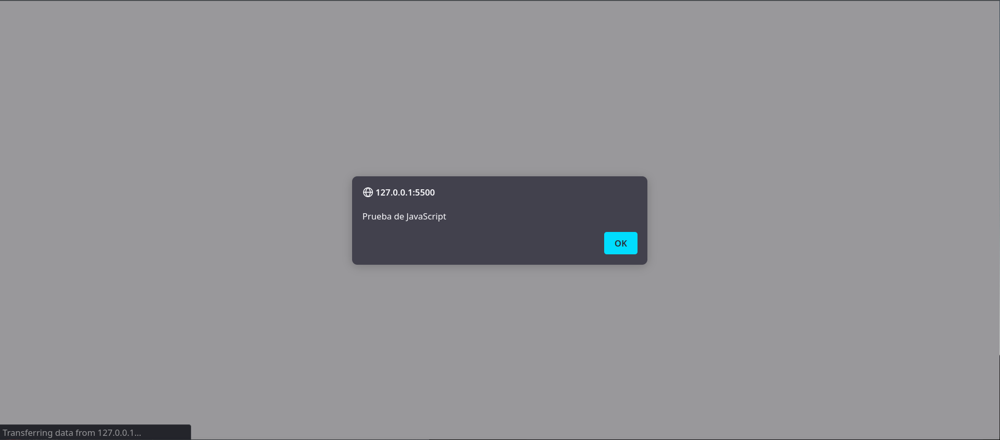

1. Teclas de acceso rápido que muestren las herramientas de desarrollo. --> [Ctrl + Shift + I]
2. Acceso a la consola. --> [Ctrl + Shift + K]
3. Acceso a los ficheros (mensaje.js en nuestro caso). --> [Ctrl + Shift + Z]
4. Reglas CSS.
  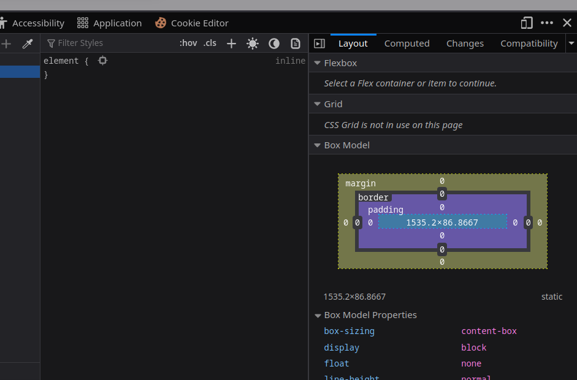 
5. Depurador. --> [Ctrl + Shift + Z]
  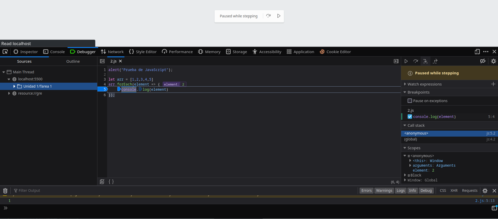 

### Chrome
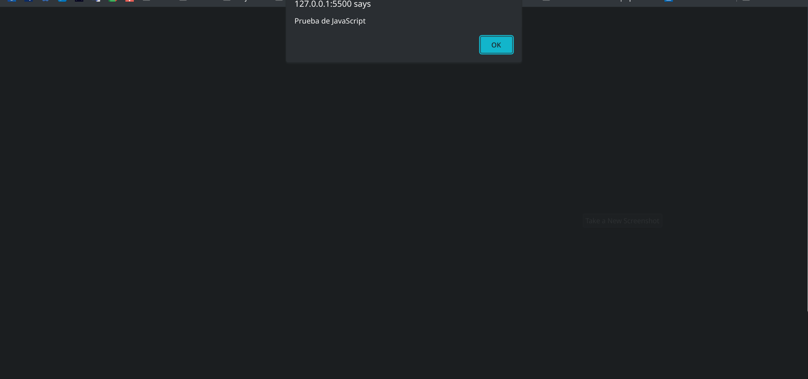

1. Teclas de acceso rápido que muestren las herramientas de desarrollo. --> [Ctrl + Shift + I]
2. Acceso a la consola. --> [Ctrl + Shift + J]
3. Acceso a los ficheros (mensaje.js en nuestro caso). --> No hay atajo
    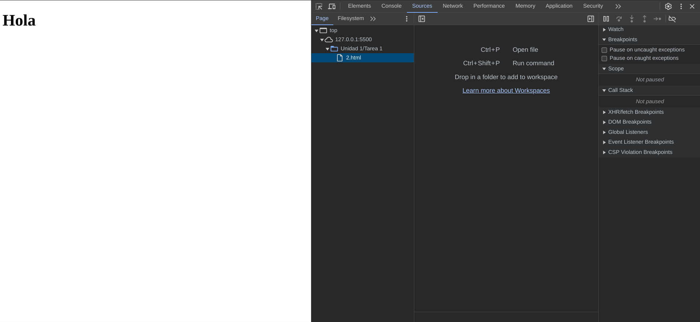
4. Reglas CSS.
  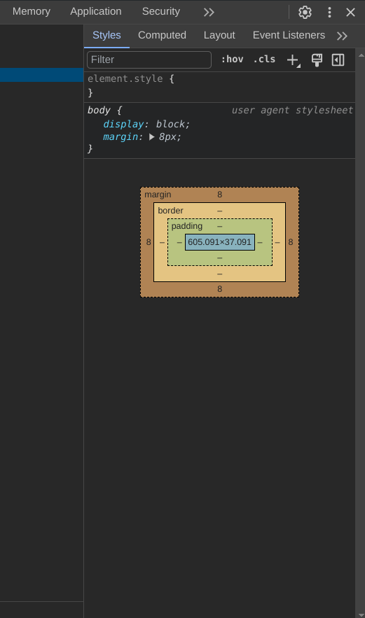 
5. Depurador. --> No hay atajo
    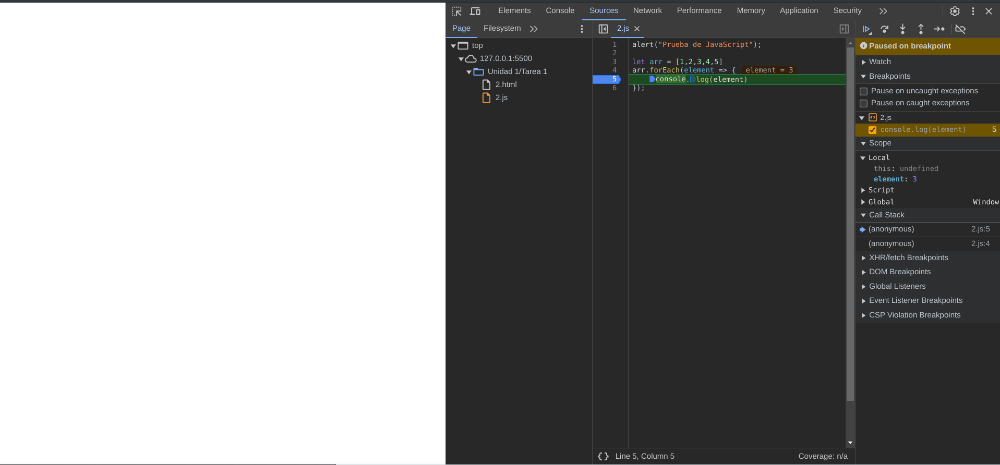

### Opera
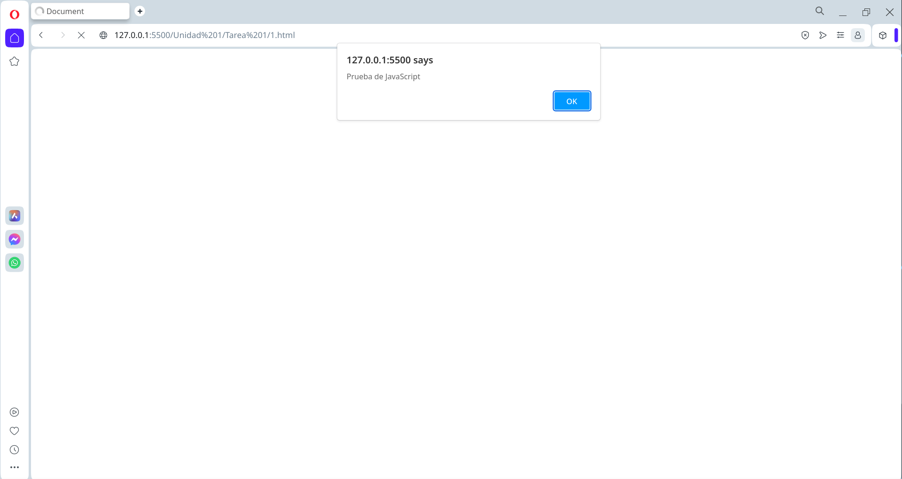

1. Teclas de acceso rápido que muestren las herramientas de desarrollo. --> [Ctrl + Shift + I]
2. Acceso a la consola. --> [Ctrl + Shift + J]
3. Acceso a los ficheros (mensaje.js en nuestro caso). --> No hay atajo
    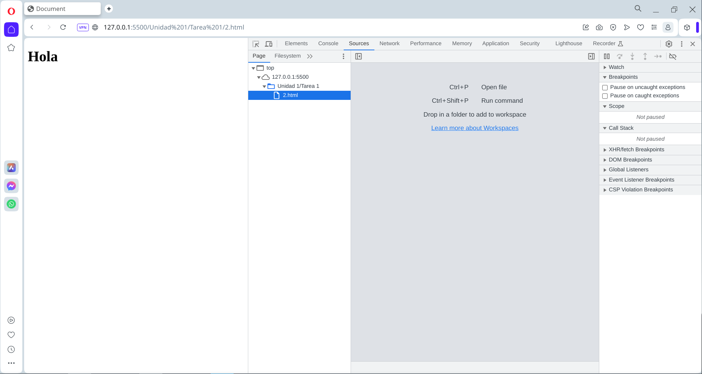
4. Reglas CSS.
  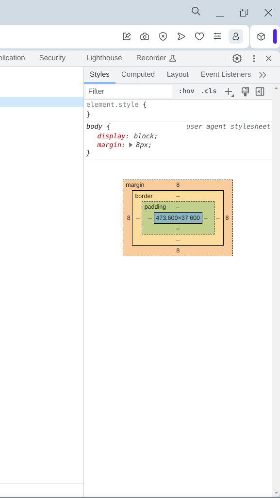 
5. Depurador. --> No hay atajo
    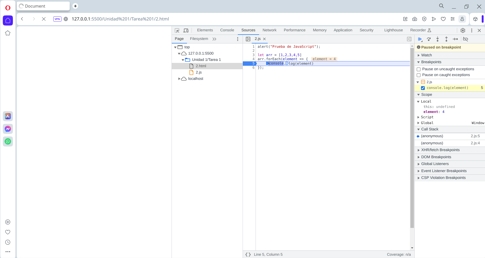

----------------------------------

### VSCode
Instalaciones necesarias para reconocimiento de código HTML y JavaScript  (No son necesarios en VSCode, aunque podemos mejorar la integración con las siguientes extensiones).
- Auto Rename Tag
- JavaScript (ES6) code snippets
- Live Server
  
Atajos en ambos lenguajes. (mínimo de 5)  
JS:
- [fin] -> for(let first in second) {third}
- [log] -> console.log();
- [anfn] -> (first) => { second }
- [error] -> console.error();
- [ifelse] -> if (condition) {} else {}

HTML:
- [html:5] -> Crea plantilla html
- [form] -> \<form action="">\</form>
- [img] -> \
- [script:src] -> \
- [a:blank] -> \<a href="http://" target="_blank" rel="noopener noreferrer">\</a>
  
### Sublime Text 4
Instalaciones necesarias para reconocimiento de código HTML y JavaScript  (No son necesarios en ST4).
  
Atajos en ambos lenguajes. (mínimo de 5)  
JS:
- [fun] -> function function_name(argument) {// body...}
- [for for] -> for (var i = Things.length - 1; i >= 0; i--) {Things[i]}
- [f] -> function() {}
- [timeout] -> setTimeout(function() {}, 10);
- [o] -> method_name: function(attribute) {},

HTML:
- [html] -> Crea plantilla html
- [lorem] -> Inserta un párrafo de Lorem Ipsum
 
### PyCharm
Instalaciones necesarias para reconocimiento de código HTML y JavaScript  (No son necesarios en PyCharm).
  
JS:
- [function] -> function f() {}
- [log] -> console.log()
- [error] -> console.error()
- [fori] -> for (let i = 0; i < ; i++) {}
- [const] -> const x = () => {}

HTML:
- [html:5] -> Crea plantilla html
- [form] -> \<form action="">\</form>
- [img] -> \
- [script:src] -> \
- [a:mail] -> \<a href="mailto:">\</a>